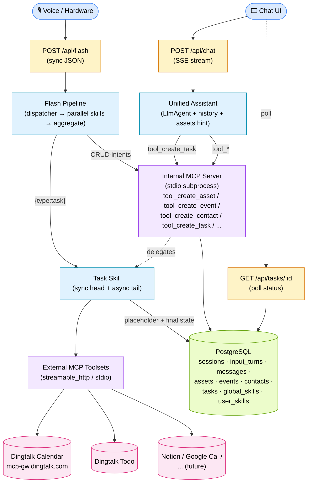
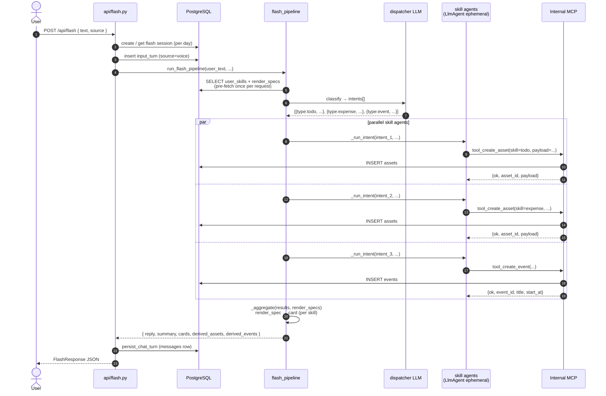
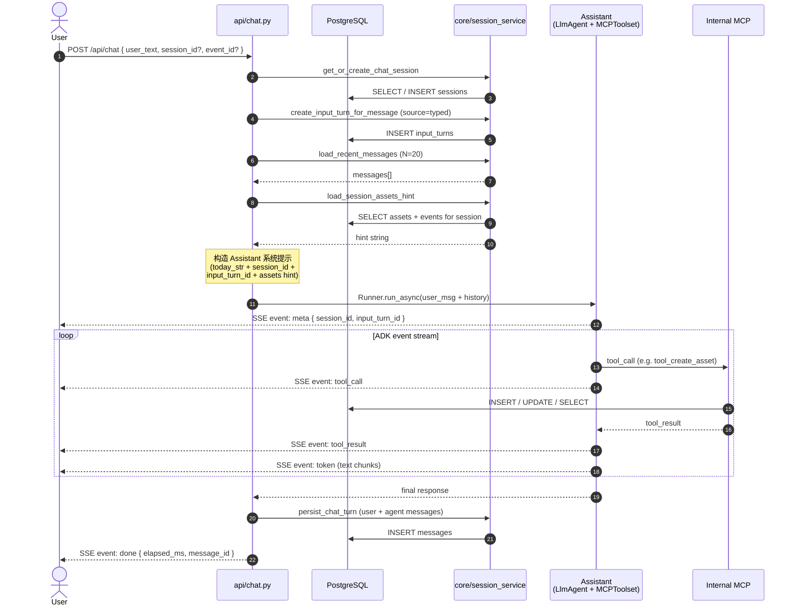
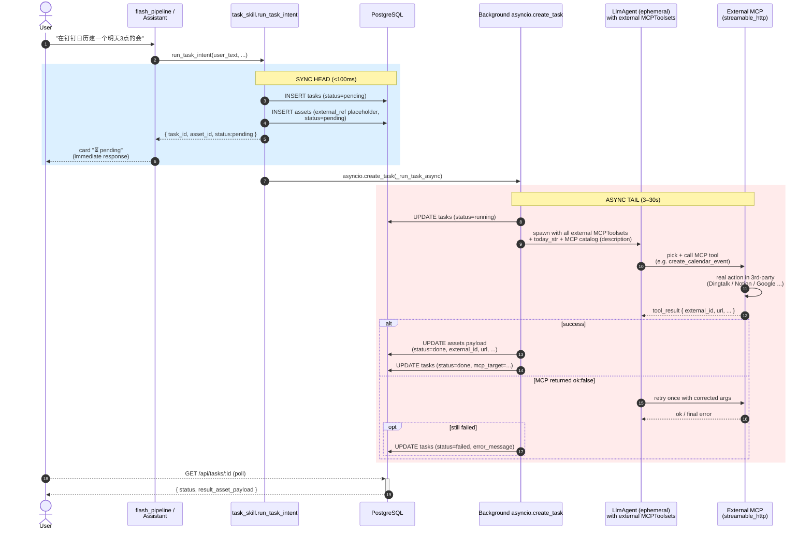
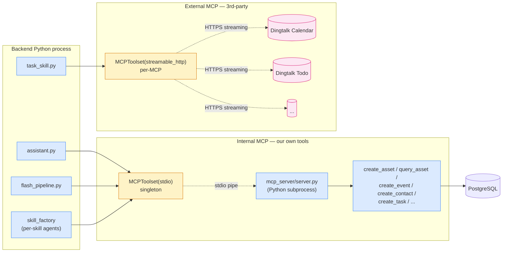
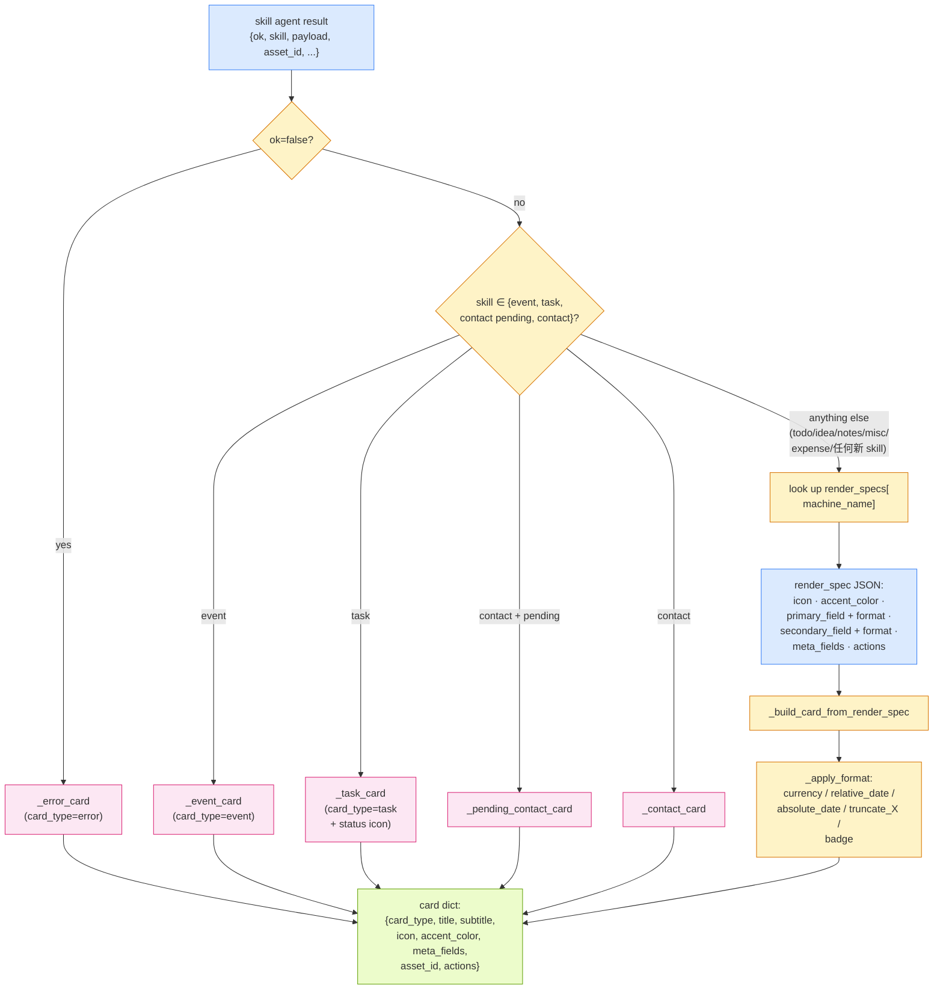
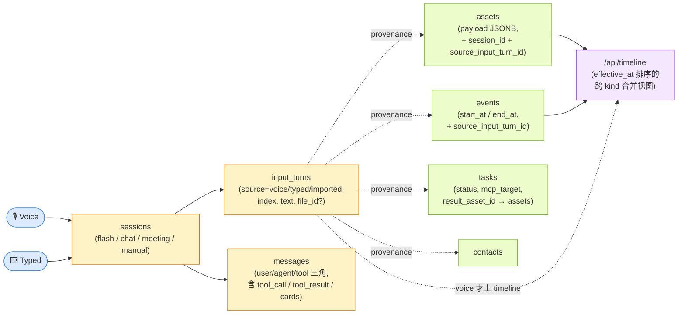

# Runtime Flow — Phase B v1.4.x

> 这份文档是 Eureka 后端在**运行时**的端到端流程图谱。配套阅读:
> - `phase-b-architecture-blueprint.md` — 静态架构(数据模型 / 模块边界 / API 契约)
> - `phase-a-product-definition.md` — 产品意图与场景定义
>
> 看 Mermaid 图请用支持渲染的 viewer(GitHub、VS Code with Markdown Preview Mermaid Support、Typora 等)。

---

## 0. 一张图看全貌

两个用户入口(Flash / Chat)、一个共享的 ADK Runner、两类 MCP(我们自己的 + 第三方)、若干持久化表。

---

## 1. Flash 流程(语音 / 闪念入口)

`POST /api/flash` 是**捕获**入口。一次输入可能拆成多个意图,并行处理后合并卡片返回。

**关键点**

- **render_specs 一次性 pre-fetch**:`run_flash_pipeline` 启动时查一次 `user_skills`,把 `render_spec` JSON 字典传到 `_aggregate` → `_make_card`,卡片生成无需 per-card DB 查询。
- **并行**:`asyncio.gather` 在意图之间并行;skill 之间不共享中间结果(无跨 skill 依赖)。
- **特殊路径**:
  - `qa` 意图 → 不出卡片,答案进 top-level `reply` 字段(对话气泡)
  - `task` 意图 → 走 task-skill 异步路径(见下面 §3)
  - `event` 意图 → 进 `events` 表(不是 `assets`),卡片用 `event_id` 而非 `asset_id`

---

## 2. Chat 流程(统一助手 + SSE 流)

`POST /api/chat` 是**对话**入口。SSE 流式返回 token / tool_call / tool_result / done 事件。

**关键点**

- **History 重放**:每次请求拉最近 20 条 message,格式化成 text 前缀给 Assistant — 解决「刚刚那个 X」的跨 turn 引用。
- **Session assets hint**:Flash 创建的 asset 不写 `messages` 表,会被 chat 历史漏掉 → 单独查一次本 session 内的 asset 注入到提示里。
- **today_str 注入**:防止模型从训练截止日期幻觉日期。
- **Event-anchored chat**:当请求带 `event_id` 时,系统提示里把当前会话锚定到那个 event。

---

## 3. Task-skill 异步流程(第三方 MCP)

用户说「同步到钉钉日历」「在 Notion 建一个页面」 → 一个 task-skill 实例,**同步立刻返 placeholder + 异步后台跑真活**。

**为什么这么设计**

- **Flash 入口对延迟敏感**(用户对着硬件说话,期望 5s 内有回应)→ task 不能阻塞 dispatcher
- **第三方 MCP 自带延迟**(Dingtalk 通常 3-5s,Web 调用更长)→ 同步等会让 flash 阻塞
- **placeholder asset 已经能渲染卡片**(状态 ⏳ pending)→ 用户立刻看到「请求被理解了,正在跑」
- **失败也是个 done 状态**(status=failed + error_message),前端能展示给用户排错

---

## 4. MCP 边界与传输层

我们有**两类** MCPToolset,分别用不同的传输协议:

**传输协议在 `agents/mcp_config.py` 里**:

| transport | 用途 | 示例 |
|---|---|---|
| `stdio` | 我们自己的 mcp_server 子进程,或 npx-起的本地 MCP(将来) | Internal MCP, fake_external |
| `streamable_http` | 钉钉 AIHub 这种官方托管 MCP gateway | dingtalk_calendar, dingtalk_todo |
| `sse` | 老一些的远程 MCP(SSE 协议) | (尚未用) |

`get_external_toolset(name)` 根据 `cfg["transport"]` 路由到对应的 `ConnectionParams` 类(ADK 提供:`StdioServerParameters` / `StreamableHTTPConnectionParams` / `SseConnectionParams`)。

---

## 5. Card 渲染管线(render_spec-driven)

把 skill agent 的结果转成前端卡片 —— **新加 skill 默认走通用路径,不改代码**。

**新加一个 skill(比如 `habit`)只需要 3 处改动,零 Python 代码改动**:

1. `backend/skills/flash-habit-skill/SKILL.md` — 创建 prompt 文件(自动被 skill_factory 发现)
2. `backend/db/seed.py` — 加 `GLOBAL_SKILLS` + `USER_SKILL_CONFIGS` 条目(含 render_spec)
3. `backend/skills/flash-dispatcher/SKILL.md` — intent 表格加一行

之后 `_make_card` 通用路径会自动生成正确的卡片。

---

## 6. 数据沉淀路径(从输入到 timeline)

每次输入都留下可追溯的多层数据:

**核心关系**

- **sessions** ←→ **input_turns** ←→ **messages**:对话流(messages),原始捕获(input_turns)
- **assets / events / contacts** 都有 `source_input_turn_id` → 谁创建的可追溯
- **tasks** 有 `result_asset_id` → 异步任务的产物是 external_ref asset
- **timeline** 按 `effective_at` 排:对 asset 是 payload 里的 due_date/at/date,对 event 是 start_at,对 input_turn / file 是 created_at(语音 turn 才上,typed 不上)

详见 `phase-b-architecture-blueprint.md` §三.5(effective_at 规则)。

---

## 7. 一些设计原则的总结

| 原则 | 体现 |
|---|---|
| **意图形态分流** | capture(Flash) / question(qa-skill 短答) / task(异步 MCP) / chat(Assistant) —— 不同入口适配不同 latency 与 UX 预期 |
| **数据驱动卡片** | 卡片样式由 UserSkill.render_spec 决定,代码里不为单独 skill 写 if/else |
| **provenance 不丢** | 每个 asset / event 都指回 input_turn,turn 指回 session —— 任何资产都能追到「是哪一句话哪一次输入产生的」 |
| **异步外部动作** | 第三方 MCP 调用一律走 task-skill 异步,sync 立刻返 placeholder,后台跑 |
| **MCP 是边界** | Agent ↔ DB 必经 MCP server;Agent ↔ 外部系统必经外部 MCPToolset。没有第二条路 |
| **render_spec / payload_schema 是 skill 的合约** | 加 skill = 加 SKILL.md(prompt 行为)+ seed 一行(数据契约)+ dispatcher 表格(意图分类),不动 pipeline 代码 |
